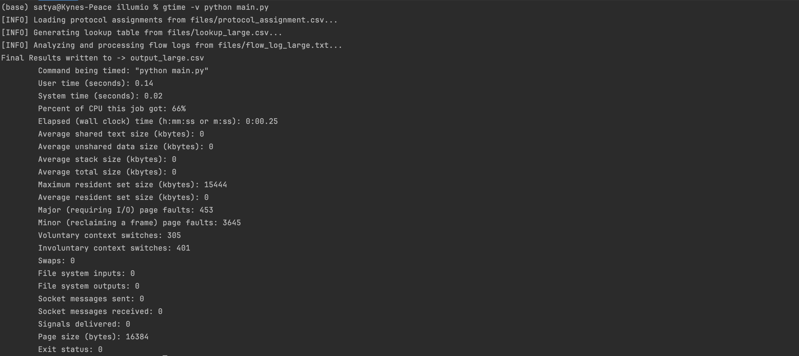
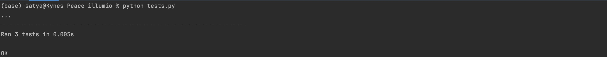

# Overview
The Flow Log Processor is a tool to analyze and process network flow logs. It
uses protocol and lookup tables to categorize and count different types of network 
traffic based on their tags and port/protocol combinations.

## Requirements 
1. Input file as well as the file containing tag mappings are plain text (ascii) files  
2. The flow log file size can be up to 10 MB 
3. The lookup file can have up to 10000 mappings 
4. The tags can map to more than one port, protocol combinations.  for e.g. sv_P1 and sv_P2 in the sample above. 
5. The matches should be case insensitive 

# Handle Large Files
Instead of loading the entire file content into memory and reading
line by line, I am reading the file in smaller chunks using a buffer size, which
can process the data incrementally without overwhelming the system's memory.
This is beneficial for files `>1GB`. This is an efficient way of reading and processing files.
Reference - https://medium.com/@anuragv.1020/chunk-by-chunk-tackling-big-data-with-efficient-file-reading-in-chunks-c6f7cf153ccd

## How to run
1. Download repository (zip) - https://github.com/Satyabrat35/Flow-Log-Processor
2. Go to project directory - `cd Flow-Log-Processor-main`
3. Run program - `python main.py`
4. Run tests - `python tests.py`

## Directory
1. `FlowLogRecords.py`: Contains functions for loading lookup tables, processing flow logs
2. `files`: Contains sample and large flow log and look up tables
3. `main.py`: The main script to execute the flow log processing
4. `tests.py`: Unit Test cases

## Error Handling
The script raises exceptions if input files are not found or if there are issues processing the files.
It ensures that the input files are correctly formatted and exist at the specified paths.

## Output

